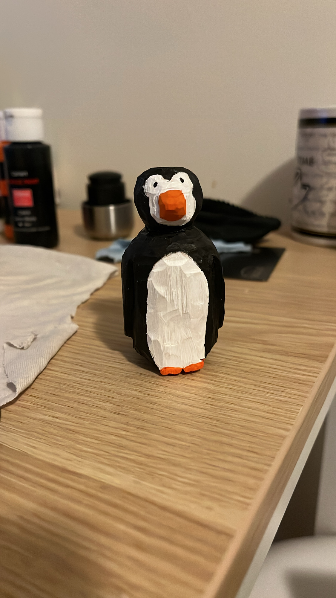
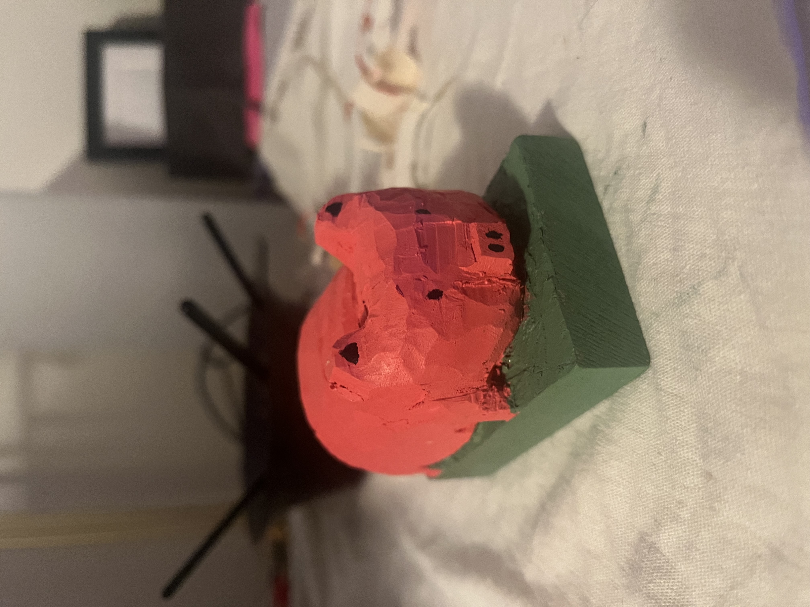

My name is Victor Porcelli. I am a Technical Research Analyst at MDRC, a non-profit dedicated to the study of policies and programs that affect people with low incomes. More specifically, I work in MDRC's Families and Children policy area, which focuses on policies and programs related to -- you guessed it -- families with children! Much of my work pertains to early childhood education, with research topics spanning from curriculum testing to workforce development.

Before coming to MDRC, I received my Bachelor's degree (cum laude) from NYU in Public Policy, with a minor in Journalism and Economics and my Master's in Public Administration, also from NYU. My MPA's specialization was Public Policy with a "focus area" in Data Science.

Now that we got the boring stuff out of the way, you should also know I do have interests outside of policy and R! I am a cat dad, a passionate home cook, and sometimes I even find the time to read (my favorites used to be short stories by Lorrie Moore, although I am still exploring what catches my interests more than TikTok these days).

I also enjoy chess, am an avid movie & TV watcher (as in, I make sure to watch the newest Love Is Blind but also any A24 film that gets released), and whittling. Yes, whittling, like with a knife and a block of wood!

And because I would be remiss to leave this out: I am a proud New Jersean.

